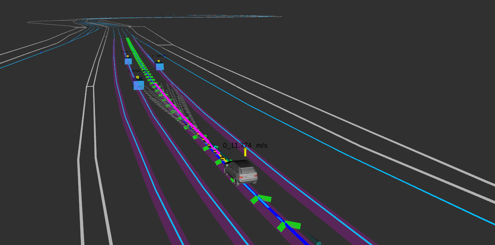
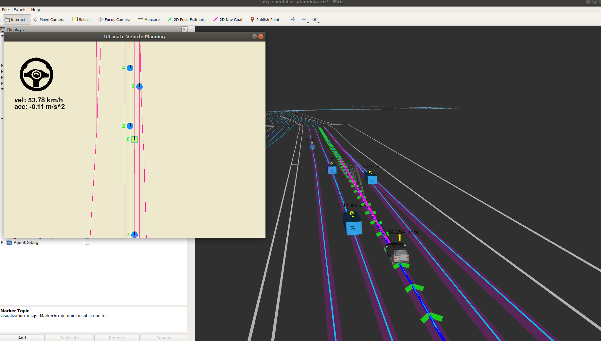
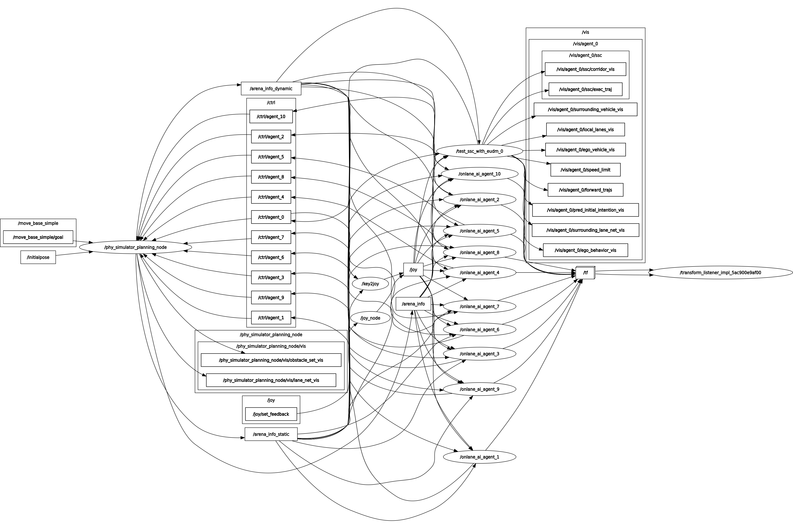

# EPSILON (Ros2 Version on Ubuntu 22.04)
This repository presents an enhanced version of the HKUST-Aerial-Robotics/EPSILON project, migrated from ROS1 to ROS2 for improved performance and compatibility with modern autonomous driving frameworks.
## About

This is the project page of the paper "**EPSILON: An Efficient Planning System for Automated Vehicles in Highly Interactive Environments**". In this repo, we provide a simple and lightweight multi-agent simulator based on ROS2 and a demo implementation of the proposed EPSILON planning system.


If you use EPSILON for your academic research, please consider citing the follow

* Ding, Wenchao, et al. "EPSILON: An Efficient Planning System for Automated Vehicles in Highly Interactive Environments." IEEE Transactions on Robotics (2021).

***Paper:*** [IEEE Xplore](https://ieeexplore.ieee.org/document/9526613/), [arXiv](https://arxiv.org/abs/2108.07993)

***Demo video:*** [YouTube](https://youtu.be/3i0cIQrZs-4)

BibTex
```
@article{ding2021epsilon,
  title={EPSILON: An Efficient Planning System for Automated Vehicles in Highly Interactive Environments},
  author={Ding, Wenchao and Zhang, Lu and Chen, Jing and Shen, Shaojie},
  journal={IEEE Transactions on Robotics},
  year={2021},
  publisher={IEEE}
}
```

The following papers are also related:
* Ding, Wenchao, et al. "Safe trajectory generation for complex urban environments using spatio-temporal semantic corridor." IEEE Robotics and Automation Letters 4.3 (2019): 2997-3004. [(arXiv link)](https://arxiv.org/abs/1906.09788)
* Zhang, Lu, et al. "Efficient uncertainty-aware decision-making for automated driving using guided branching." 2020 IEEE International Conference on Robotics and Automation (ICRA). IEEE, 2020. [(arXiv link)](https://arxiv.org/abs/2003.02746)


If you have any question, please feel free to contact us via `lzhangbz@connect.ust.hk (Lu Zhang)` and `wdingae@connect.ust.hk (Wenchao Ding)`.


## Prerequisites
This project has been tested on Ubuntu 22.04 (ROS2 humble). For ROS installation, please refer to the official [website](http://wiki.ros.org/ROS/Installation).

### Denpendencies

* Install required packages
```
sudo apt-get install libgoogle-glog-dev libdw-dev libopenblas-dev gfortran
```

```
pip install empy pygame
```

#### Install OOQP
Prerequisites:

**BLAS：**

```bash
wget http://www.netlib.org/blas/blas.tgz
tar zxf blas.tgz
cd BLAS-3.12.0/
gfortran -O3 -std=legacy -m64 -fno-second-underscore -fPIC -c *.f
ar r libfblas.a *.o
ranlib libfblas.a
rm -rf *.o     
export BLAS=~/my_lib/BLAS-3.10.0/libfblas.a 
```

**MA27：**

```bash
git clone https://github.com/HITSZ-LeggedRobotics/ma27.git
cd ma27/ma27-1.0.0/
bash ./configure CPPFLAGS="-fPIC" CFLAGS="-fPIC" FFLAGS="-fPIC"
sudo make install
```
* Copy the libma27.a file in ma27/src to the ooqp folder

**OOQP**
```bash
git clone https://github.com/emgertz/OOQP.git
cd OOQP/
./configure
sudo make
sudo make install
```

We use [OOQP](http://pages.cs.wisc.edu/~swright/ooqp/) for solving quadratic programming problems. Please refer to [link_1](https://github.com/emgertz/OOQP) and [link_2](http://pages.cs.wisc.edu/~swright/ooqp/) for the installation instruction.


#### Install Protobuf
We use [Protocol Buffers](https://developers.google.com/protocol-buffers/) for parameter configuration. For the installation guide, please refer to this [link](https://github.com/protocolbuffers/protobuf/blob/master/src/README.md).


## Build on ROS
We recommend the users create an empty workspace. Clone the repo and build:
```
  cd ${YOUR_WORKSPACE_PATH}/src
  git clone https://github.com/ZhouTao415/Autonomous-Motorsports-Motion-Planning-for-the-IAC.git
  cd EPSILON/
  colcon build
  source ~/${YOUR_WORKSPACE_PATH}/install/setup.bash
```

## Just have a try!

1. Launch RViz with `.rviz` file:
```
cd EPSILON/src/core/phy_simulator/rviz/
ros2 run rviz2 rviz2 --display-config phy_simulator_planning.rviz 
```

2. Launch the planner's node and AI nodes:
```
ros2 launch planning_integrated test_ssc_with_eudm_ros_launch.py
```

```
ros2 launch ai_agent_planner onlane_ai_agent_launch.py
```

3. Launch the simulator:
```
ros2 launch phy_simulator phy_simulator_planning_launch.py
```
Note that the simulator should be launched last.

<p align="center">
  
</p>


4. We provide a simple interface for controlling the behavior of the agents:
```
cd aux_tools/src/
python3 terminal_server.py
```

<p align="center">
  
</p>

You can select the target agent by clicking on the colored dots and change its behavior using `W-A-S-D` buttons.

5. ros node & topic graph

<p align="center">
  
</p>

## Acknowledgements
We would like to express sincere thanks to the authors of the following tools and packages:
* Lock-free queue: [moodycamel](https://github.com/cameron314/concurrentqueue)
* Json parser: [JSON for modern C++](https://github.com/nlohmann/json)
* KD-Tree library: [nanoflann](https://github.com/jlblancoc/nanoflann)
* 2D ray-casting: [roguelike_FOV](https://gist.github.com/zloedi/9551625)
* Quadratic programming: [OOQP](http://pages.cs.wisc.edu/~swright/ooqp/)
* Cubic spline fitting: [tk_spline](https://github.com/ttk592/spline)

## Licence

The source code is released under [MIT](https://opensource.org/licenses/MIT) license.


## Disclaimer

This is research code, it is distributed in the hope that it will be useful, but WITHOUT ANY WARRANTY; without even the implied warranty of merchantability or fitness for a particular purpose.
